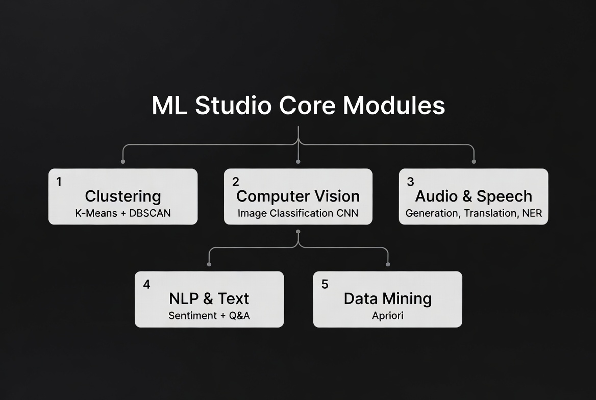
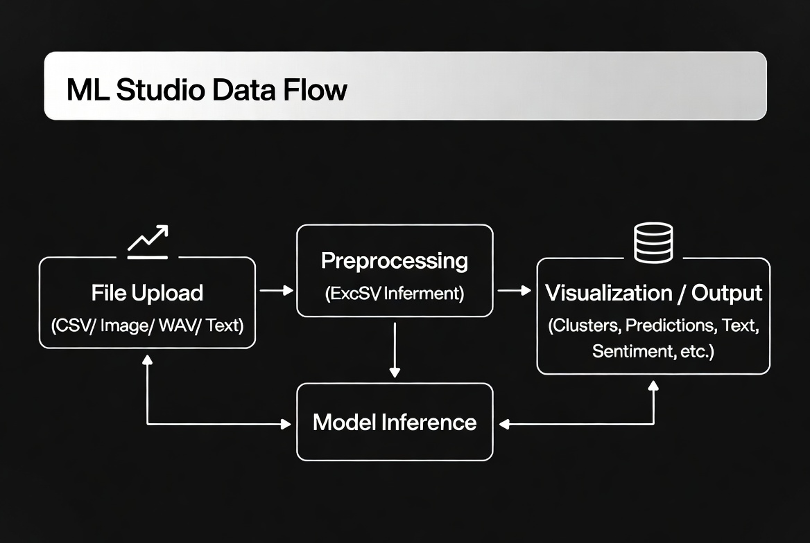
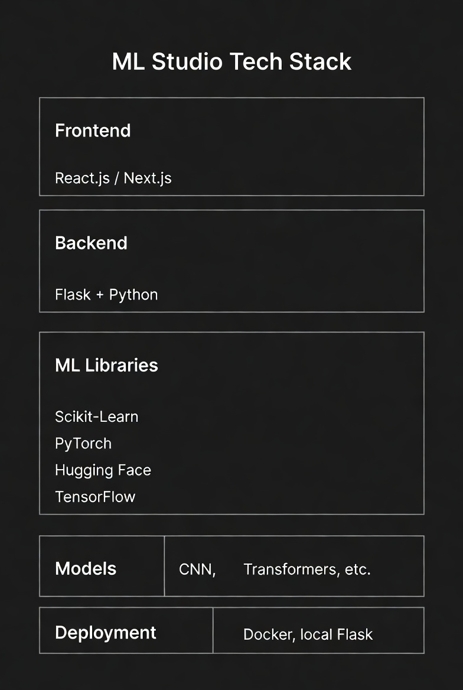

## 🏗️ System Architecture

### Architecture Overview

ML Studio follows a modular architecture consisting of a web-based user interface, backend inference services, machine learning pipelines, model orchestration, and result visualization components.

---

## 🧩 Core Modules

The platform integrates multiple AI domains into a unified system:

* Clustering
* Computer Vision
* Audio & Speech Processing
* NLP & Text Processing
* Data Mining

---

## 🔄 Data Flow Pipeline

The workflow begins with user data ingestion, followed by preprocessing, model inference, and result generation. Outputs are returned through the dashboard with visualizations and predictions.

---

## ⚙️ Technology Stack

---

## 📸 Application Screenshots

### ML Studio Dashboard

### DBSCAN Clustering

### K-Means Clustering

### CNN Image Classification

### Voice Sentiment Analysis

### Voice Question Answering

### GPT-2 Text Generation

### English → Urdu Translation

### Named Entity Recognition (NER)

### Apriori Association Rule Mining

---
