# 🚀 ML Studio

### Unified AI & Machine Learning Inference Platform


---

## 📌 Overview

ML Studio is a full-stack Machine Learning platform that integrates multiple AI domains into a single web application. The platform enables users to upload datasets, images, audio files, and text inputs, execute machine learning models, and visualize results through a centralized dashboard.

The project combines concepts from Machine Learning, Deep Learning, Natural Language Processing, Speech Processing, Computer Vision, and Data Mining into one unified system.

---

## 🎯 Key Highlights

* Integrated **8+ Machine Learning Modules**
* Built a complete **Flask-based AI Platform**
* Supports **Clustering, NLP, Speech, Computer Vision, and Data Mining**
* Interactive web dashboard for model execution
* Real-time inference and visualization
* Modular architecture for future MLOps expansion

---

## 🏗️ System Architecture

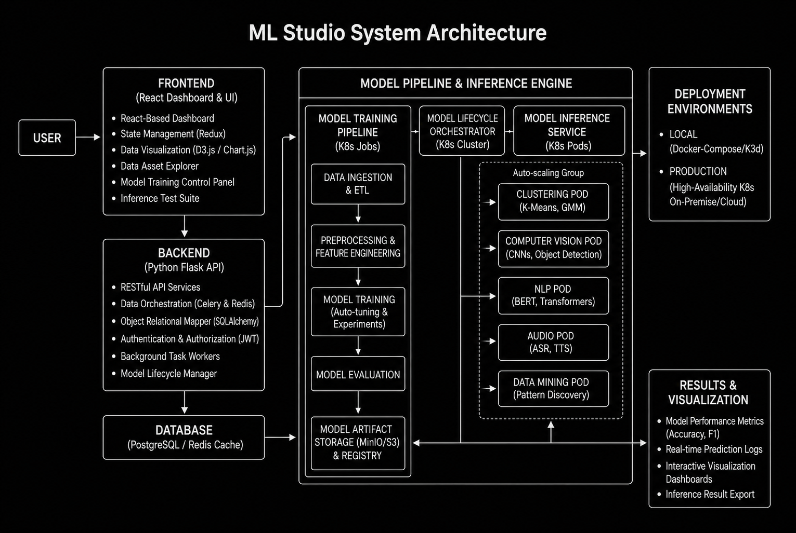

### Architecture Overview

ML Studio follows a layered architecture:

* **Frontend Layer**

  * Dashboard Interface
  * File Upload Components
  * Result Visualization

* **Backend Layer**

  * Flask REST APIs
  * Request Routing
  * Model Management

* **Machine Learning Layer**

  * Clustering Pipelines
  * NLP Models
  * Speech Processing
  * Computer Vision
  * Data Mining

* **Data Layer**

  * Dataset Storage
  * Model Storage
  * Result Management

---

## 🔥 Core Features

| Domain           | Module                     | Technology           |
| ---------------- | -------------------------- | -------------------- |
| Clustering       | K-Means Clustering         | Scikit-Learn         |
| Clustering       | DBSCAN Clustering          | Scikit-Learn         |
| Computer Vision  | CNN Image Classification   | TensorFlow / PyTorch |
| Audio Processing | Voice Sentiment Analysis   | Speech-to-Text + NLP |
| Audio Processing | Voice Question Answering   | Speech Pipeline      |
| NLP              | GPT-2 Text Generation      | Hugging Face         |
| NLP              | English → Urdu Translation | Transformers         |
| NLP              | Named Entity Recognition   | Transformers         |
| Data Mining      | Apriori Association Rules  | Mlxtend              |

---

## 🛠️ Tech Stack

### Frontend

* HTML5
* CSS3
* JavaScript
* Jinja2 Templates

### Backend

* Python
* Flask

### Machine Learning

* Scikit-Learn
* TensorFlow
* PyTorch
* Hugging Face Transformers
* Pandas
* NumPy

---

## 📸 Application Screenshots

### Dashboard

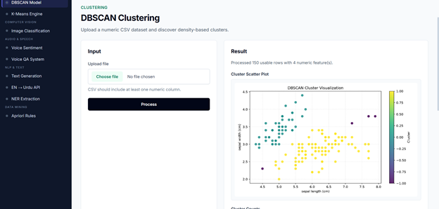

### K-Means Clustering

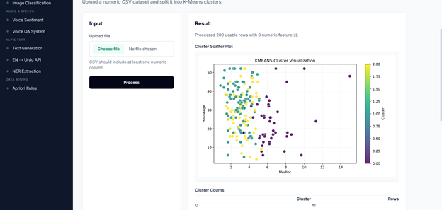

### DBSCAN Clustering

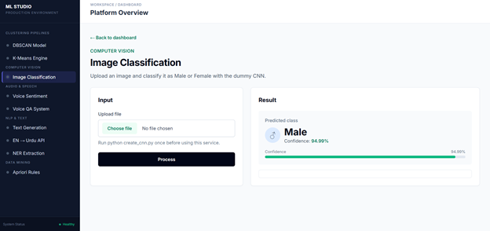

### CNN Image Classification

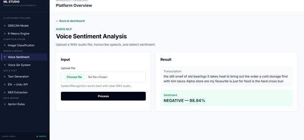

### Voice Sentiment Analysis

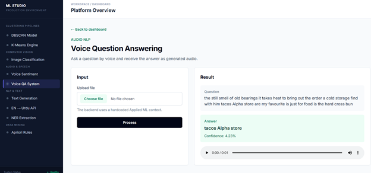

### Voice Question Answering

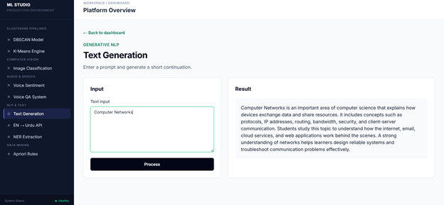

### Text Generation

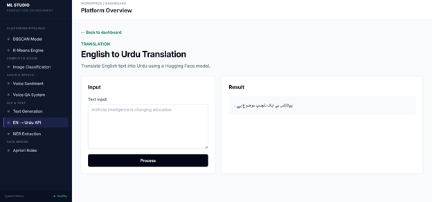

### English to Urdu Translation

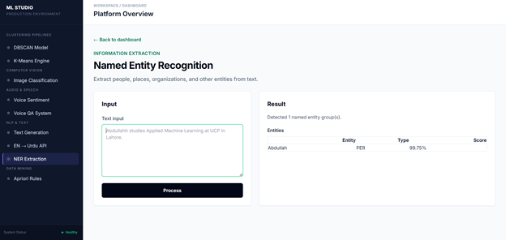

### Named Entity Recognition

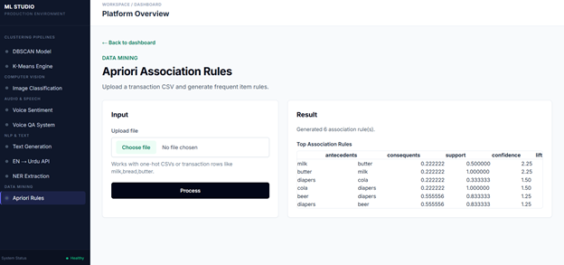

### Apriori Association Rules

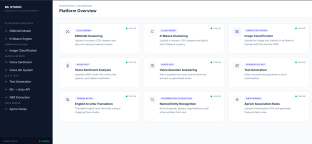

---

## 📂 Project Structure

```bash
ML_Studio/
│
├── app.py
├── models/
├── static/
├── templates/
├── cnn_datasets/
├── transformer_text_generation/
├── Screenshots/
└── README.md
```

---

## 🚀 Getting Started

### Clone Repository

```bash
git clone https://github.com/Abdullah-Maqbool1/ML_Studio.git
cd ML_Studio
```

### Install Dependencies

```bash
pip install -r requirements.txt
```

### Run Application

```bash
python app.py
```

Open:

```text
http://127.0.0.1:5000
```

---

## 📈 Future Improvements

* User Authentication
* Model Retraining Through UI
* Docker Deployment
* Real-Time Analytics Dashboard
* Performance Monitoring
* Cloud Deployment Support

---

## 👥 Team

| Name             | Registration Number |
| ---------------- | ------------------- |
| Areef ur Rahman  | L1F23BSSE0389       |
| Abdullah Maqbool | L1F23BSSE0391       |
| M. Hafeez        | L1F23BSSE0396       |

**Course:** Applied Machine Learning
**Section:** F2
**Instructor:** Prof. Hafiz Mahfooz ul Haque

---

## ⭐ Resume Keywords

Machine Learning • Deep Learning • Computer Vision • Natural Language Processing • Speech Processing • Transformers • Flask • REST APIs • CNN • GPT-2 • NER • K-Means • DBSCAN • Apriori • Full Stack AI Platform

---

### Made with ❤️ at University of Central Punjab
